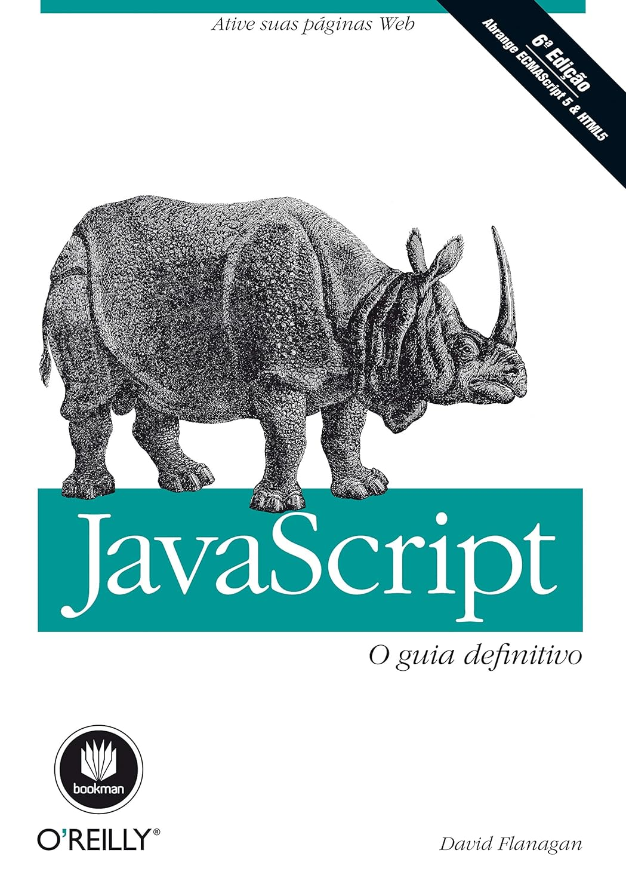

Este repositório tem como objetivo realizar uma leitura profunda sobre o livro Javascript - O guia definitivo de David Flanagan, tendo como ótica a minha perspectiva e praticar com os códigos de cada capítulo pontuado pelo autor, que ilustram os assuntos abordados em cada tópico.

